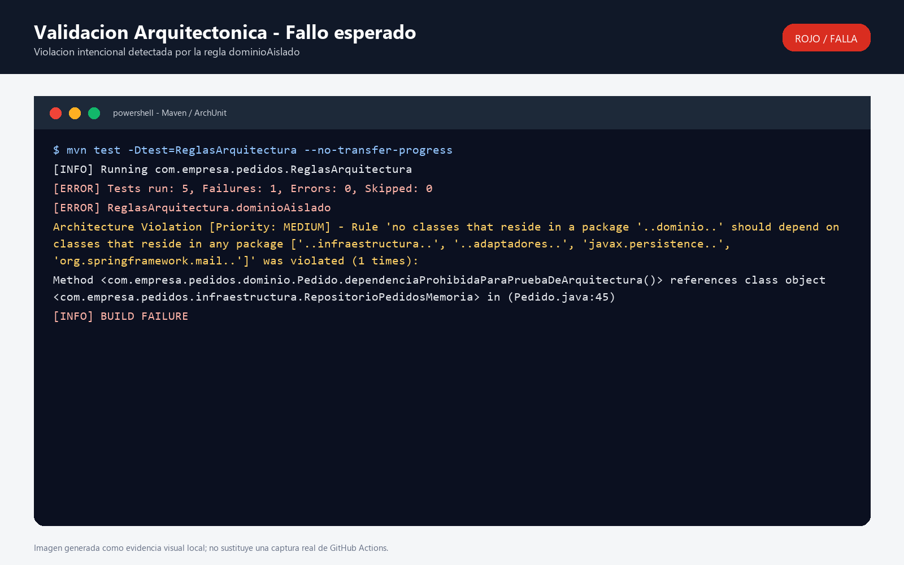
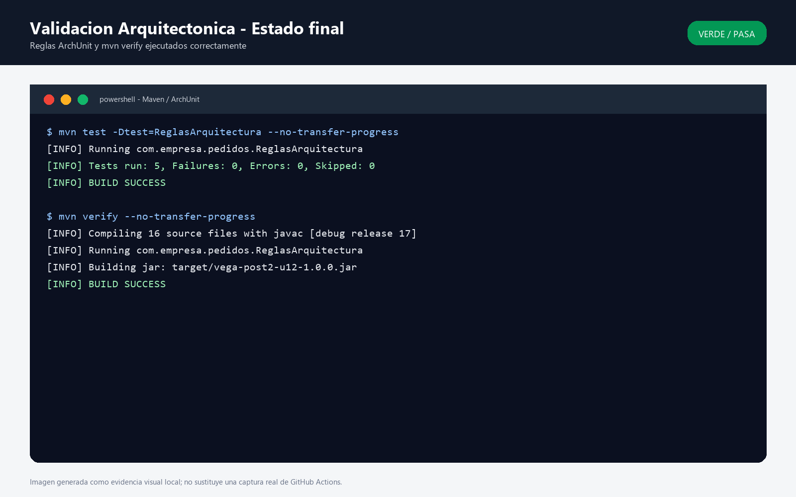

# Vega Post 2 U12

Sistema de pedidos en Java para el Post-Contenido 2 de la Unidad 12. El proyecto implementa validacion arquitectonica con ArchUnit, documenta decisiones de diseno con ADRs y ejecuta las reglas en GitHub Actions.

## Tecnologias

- Java 17
- Maven
- ArchUnit 1.2.1
- JUnit 5
- Spring Web y Spring Context como dependencias de soporte para adaptadores

## Estructura principal

- `src/main/java/com/empresa/pedidos/dominio`: entidades, eventos, enums y puertos del dominio.
- `src/main/java/com/empresa/pedidos/adaptadores/facade`: fachada que orquesta el caso de uso de pedidos.
- `src/main/java/com/empresa/pedidos/adaptadores/rest`: controlador REST que expone el sistema.
- `src/main/java/com/empresa/pedidos/adaptadores/procesadores`: estrategias de procesamiento por tipo de pedido.
- `src/main/java/com/empresa/pedidos/infraestructura`: implementaciones tecnicas para persistencia en memoria y eventos.
- `src/test/java/com/empresa/pedidos/ReglasArquitectura.java`: reglas ArchUnit.
- `.github/workflows/arquitectura.yml`: pipeline de validacion arquitectonica.
- `docs/adr`: decisiones arquitectonicas del proyecto.

## Validacion Arquitectonica

Las reglas ArchUnit convierten las decisiones de diseno en pruebas ejecutables. Para correrlas localmente:

```bash
mvn test -Dtest=ReglasArquitectura --no-transfer-progress
```

Las 5 reglas implementadas son:

1. `dominioAislado`: ninguna clase del dominio puede depender de infraestructura, adaptadores, JPA ni Spring Mail.
2. `controladoresSoloAccedenALaFacade`: los controladores REST solo pueden acceder a la fachada, al dominio, a Spring Web, a Java y a su propio paquete.
3. `puertosDeDominioSonInterfaces`: todos los puertos ubicados en `dominio.puertos` deben ser interfaces.
4. `procesadoresImplementanProcesadorPedido`: todos los procesadores en `adaptadores.procesadores` deben implementar el puerto `ProcesadorPedido`.
5. `infraestructuraNoAccedeAAdaptadoresRest`: la infraestructura no puede acceder a clases del adaptador REST.

El workflow `Validacion Arquitectonica` se ejecuta en cada push a `main` y `develop`, y tambien en pull requests hacia `main`. Primero ejecuta las pruebas de arquitectura con:

```bash
mvn test -Dtest=ReglasArquitectura --no-transfer-progress
```

Luego ejecuta la suite completa:

```bash
mvn verify --no-transfer-progress
```

## Decisiones ADR

Las decisiones documentadas estan en `docs/adr`:

- `ADR-001.md`: Arquitectura Hexagonal para aislar el dominio.
- `ADR-002.md`: Factory + Strategy para seleccion de procesador.
- `ADR-003.md`: Spring Events como implementacion de Observer para notificaciones.

Cada ADR incluye las secciones obligatorias: Estado, Contexto, Decision y Consecuencias.

## Evidencias de ejecucion

### Pipeline rojo: violacion detectada

La siguiente evidencia muestra la violacion arquitectonica intencional usada para comprobar que ArchUnit detecta dependencias prohibidas desde el dominio hacia infraestructura.



### Pipeline verde: estado final corregido

La siguiente evidencia muestra el estado final despues de retirar la violacion intencional. Las 5 reglas ArchUnit pasan y `mvn verify` finaliza correctamente.



## Verificacion local

Antes de entregar el proyecto se debe verificar:

```bash
mvn test -Dtest=ReglasArquitectura --no-transfer-progress
mvn verify --no-transfer-progress
```

Ambos comandos deben finalizar sin errores despues de revertir la violacion arquitectonica intencional usada para probar el pipeline rojo.
